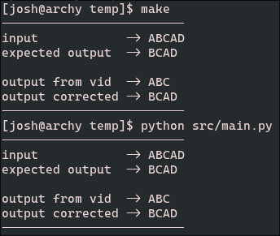
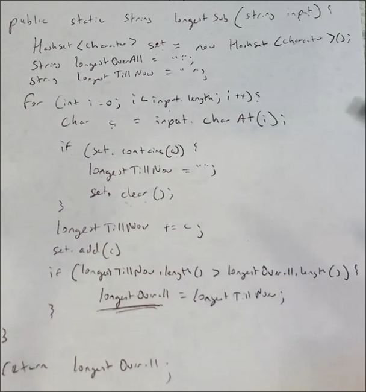

# Longest Non-repeating Substring

Hi! I have included Python code and C++ code to demonstrate the problem with the code in the video. For each language, I have implemented the function from the video, followed by a corrected function. It's only 3-4 lines of code that makes the algorithm incorrect.

## Running the Examples

I've included examples to read/run.



### C++

Just run `make`. I have configured the makefile to compile/link, run the binary, then clean up the binary.

### Python

Run `python3 ./src/main.py`.

## Short Version

In the for loop, this ([line 17](./src/main.cpp#L17)):

```cpp
if (set.contains(c)) {
    longestTillNow = "";
    set.clear();
}
```

...needs to be replaced with this ([line 41](./src/main.cpp#L41)):

```cpp
while (set.contains(c)) {
    set.erase(longestTillNow[0]);
    longestTillNow = longestTillNow.substr(1);
}
```

## Breakdown



The input used in the video was `"ABCAB"`. The video _does_ give us the correct answer of `"ABC"`.

However, I would like to use a different input for this example, `"ABCAD"`. While `"ABC"` is a substring, it's not the longest. `"BCAD"` (last 4 chars) is the longest. Using the algorithm from the video, along with my new input, gives us the incorrect answer of `"ABC"`. Here is how.

## Problem

Let's iterate through the for loop and I will keep track of state for us. Remember, the input is `"ABCAD"` and the correct answer is `"BCAD"`.

#### 1st iteration

Our char is `A` and `set` is empty, so no repeating chars are found. We append `A` to `longestTillNow`, add it to `set`, and set `longestOverall = longestTillNow`.

```
| i | set (unordered) | longestTillNow | longestOverall |
|---|-----------------|----------------|----------------|
| 0 | ('A')           | "A"            | "A"            | 
```

#### 2nd, 3rd iteration

Same as first

```
| i | set (unordered) | longestTillNow | longestOverall |
|---|-----------------|----------------|----------------|
| 1 | ('A', 'B')      | "AB"           | "AB"           | 
| 2 | ('A', 'B', 'C') | "ABC"          | "ABC"          |
```

#### 4th iteration

At the beginning of the block, `set` is still `('A', 'B', 'C')`. Our current char is `A` again. We check if `A` is in `set` and it is!

So we _erase_ `set` and `longestTillNow` 😱

```cpp
if (set.contains(c)) {
    longestTillNow = "";
    set.clear();
}
```

This is a problem, because `longestTillNow` is `"ABC"` we know the correct answer contains the `B` and `C` from that. Now our `longestOverall` is `"ABC"`, `set` and `longestTillNow` are empty, then we populate them with the new `A` char.

```
| i | set (unordered) | longestTillNow | longestOverall |
|---|-----------------|----------------|----------------|
| 3 | ('A')           | "A"            | "ABC"          | <-- problem
```

#### 5th iteration

Last, we handle `D` the same way we handled the first 3 iterations, leaving us with `longestTillNow -> "AD"` and importantly `longestOverall -> "ABC"`.

```
| i | set (unordered) | longestTillNow | longestOverall |
|---|-----------------|----------------|----------------|
| 4 | ('A', 'D')      | "AD"           | "ABC"          |
```

#### Conclusion

Because we erased 2 of the characters from `longestTillNow` that should have been in the final answer, we never arrived at the correct answer of `"BCAD"`.

```
| i | set (unordered) | longestTillNow | longestOverall |
|---|-----------------|----------------|----------------|
| 0 | ('A')           | "A"            | "A"            | 
| 1 | ('A', 'B')      | "AB"           | "AB"           | 
| 2 | ('A', 'B', 'C') | "ABC"          | "ABC"          |
| 3 | ('A')           | "A"            | "ABC"          | <-- problem
| 4 | ('A', 'D')      | "AD"           | "ABC"          |
```


## Solution

Let's do this again, but instead of erasing the `set` and `longestTillNow`, we will remove the _first_ character from `longestTillNow`, remove that same char from `set` as well, then check if current char is still in the set. Repeat if it is. Looks like this:

#### 1st, 2nd, 3rd iteration

Same as before

```
| i | set (unordered)      | longestTillNow | longestOverall |
|---|----------------------|----------------|----------------|
| 0 | ('A')                | "A"            | "A"            | 
| 1 | ('A', 'B')           | "AB"           | "AB"           | 
| 2 | ('A', 'B', 'C')      | "ABC"          | "ABC"          |
```

#### 4th iteration

At the beginning of the block, `set` is `('A', 'B', 'C')`. Our current char is `A` again.

__While__ our current char (`input[i]`) is in `set`, we pop (removing it) the _first_ char of `longestTillNow`, and remove it from `set` as well. This shortens `longestTillNow` until our current char (`input[i]`) is no longer in `set`.

```cpp
while (set.contains(c)) {
    set.erase(longestTillNow[0]);
    longestTillNow = longestTillNow.substr(1);
}
```

In our case, we only need to do it once. We pop `A` from `longestTillNow`, which was `"ABC"`, now making it `"BC"`. We also remove this `A` from the set. Now `set` is `('B', 'C')` and we check if our current char (`input[i]`, which is `A` in this case) is in the set.

`A` is no longer in the set! We continue on as normal, appending our current char `A` to `longestTillNow`, making it go from `"BC"` -> `"BCA"`. `longestOverall` is still `"ABC"` though because it's length is not less than `longestTillNow`.

```
| i | set (unordered)      | longestTillNow | longestOverall |
|---|----------------------|----------------|----------------|
| 3 | ('B', 'C', 'A')      | "BCA"          | "ABC"          | <-- fixed
```

#### 5th iteration

At the beginning of the block, `longestTillNow` is `"BCA"`. We continue with `D` and end up appending it, giving us the final answer of `"BCAD"`.

```
| i | set (unordered)      | longestTillNow | longestOverall |
|---|----------------------|----------------|----------------|
| 4 | ('B', 'C', 'A', 'D') | "BCAD"         | "BCAD"         |
```

#### Conclusion

```
| i | set (unordered)      | longestTillNow | longestOverall |
|---|----------------------|----------------|----------------|
| 0 | ('A')                | "A"            | "A"            | 
| 1 | ('A', 'B')           | "AB"           | "AB"           | 
| 2 | ('A', 'B', 'C')      | "ABC"          | "ABC"          |
| 3 | ('B', 'C', 'A')      | "BCA"          | "ABC"          | <-- fixed
| 4 | ('B', 'C', 'A', 'D') | "BCAD"         | "BCAD"         |
```

## Further Optimizations

In the new code, when we lob off the first character:

```cpp
longestTillNow = longestTillNow.substr(1);
```

...we are allocating all new memory with `.substr()`. The old memory is automatically freed, _however_, allocating memory from the heap requires syscalls, which are always _very_ slow.

We can avoid this by tracking `longestTillNow` and `longestOverall` substrings using indices instead of allocating new buffers to store them. For example, instead of:

```cpp
std::string longestOverall = "";
std::string longestTillNow = "";
```

...we could do:

```cpp
int longestOverallBeg = 0;
int longestOverallEnd = 0;
int longestTillNowBeg = 0;
int longestTillNowEnd = 0;
```

So we could replace the use of `.substr()` and lob off the first character like so:
```cpp
longestTillNowBeg += 1;
```

...and return the substring at the end of the function like so:
```cpp
return input.substr(longestOverallBeg, longestOverallEnd);
```
